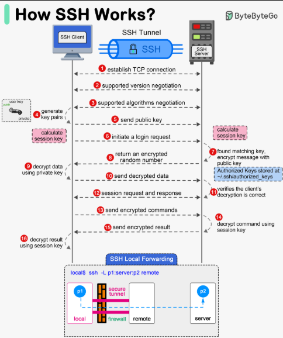

# Quá trình xác thực SSH

## 1. Generate key pairs
**Ý nghĩa:** Máy khách (client) thường tạo cặp khóa riêng (private key) và khóa công khai (public key).  
**Mục đích:** Đảm bảo chỉ client nào sở hữu private key mới giải mã được dữ liệu mà server mã hóa bằng public key tương ứng.

## 2. Establish TCP connection
**Ý nghĩa:** Client khởi tạo một kết nối TCP đến cổng SSH của server (mặc định là 22).  
**Mục đích:** Tạo kênh liên lạc ở tầng vận chuyển để trao đổi dữ liệu.

## 3. Supported version negotiation
**Ý nghĩa:** Hai bên trao đổi phiên bản SSH (ví dụ: SSH-2.0) để kiểm tra tính tương thích.  
**Mục đích:** Đảm bảo cả client và server dùng cùng một phiên bản SSH.

## 4. Supported algorithms negotiation
**Ý nghĩa:** Client và server thỏa thuận thuật toán mã hóa, thuật toán băm (hash), và phương thức trao đổi khóa (như Diffie-Hellman).  
**Mục đích:** Chọn cơ chế bảo mật tối ưu, hỗ trợ hai bên thiết lập kênh an toàn.

## 5. Send public key
**Ý nghĩa:** Client gửi public key cho server (hoặc server gửi host key cho client, tùy giai đoạn).  
**Mục đích:** Cho phép phía còn lại mã hóa dữ liệu để chỉ người giữ private key mới giải mã được.

## 6. Initiate a login request
**Ý nghĩa:** Client bắt đầu quá trình đăng nhập (login), gửi thông tin người dùng và đề xuất phương thức xác thực.  
**Mục đích:** Xác định danh tính client, chuẩn bị cho bước xác thực.

## 7. Return an encrypted random number
**Ý nghĩa:** Server tạo một chuỗi ngẫu nhiên, mã hóa bằng public key của client, rồi gửi lại.  
**Mục đích:** Kiểm tra xem client có thật sự nắm giữ private key tương ứng hay không.

## 8. Calculate session key
**Ý nghĩa:** Client giải mã chuỗi ngẫu nhiên (bằng private key), rồi từ đó sinh ra session key.  
**Mục đích:** Session key dùng để mã hóa toàn bộ phiên làm việc sau này, giúp tăng tốc (vì sử dụng mã hóa đối xứng).

## 9. Authorized keys stored at .ssh/authorized_keys
**Ý nghĩa:** Server kiểm tra public key của client trong file `authorized_keys`.  
**Mục đích:** Nếu public key của client có trong danh sách được phép, server mới tiếp tục cho xác thực.

## 10. Send decrypted data using private key
**Ý nghĩa:** Client chứng minh khả năng giải mã bằng cách gửi lại dữ liệu (hoặc chữ ký) đã được giải mã.  
**Mục đích:** Khẳng định quyền sở hữu private key, hoàn tất xác thực công khai (public key authentication).

## 11. Send encrypted request and response
**Ý nghĩa:** Sau khi xác thực, mọi yêu cầu từ client và phản hồi từ server đều được mã hóa bằng session key.  
**Mục đích:** Đảm bảo an toàn, chống nghe lén và giả mạo dữ liệu.

## 12. Send encrypted commands
**Ý nghĩa:** Client gửi các lệnh SSH (chẳng hạn: chạy lệnh trên server) qua kênh đã mã hóa.  
**Mục đích:** Thao tác trên server từ xa mà vẫn giữ tính bảo mật và toàn vẹn dữ liệu.

## 13. Decrypt result using session key
**Ý nghĩa:** Kết quả từ server cũng được mã hóa, client dùng session key để giải mã.  
**Mục đích:** Bảo vệ thông tin phản hồi, chỉ client có session key mới đọc được.

## 14. Server verifies the client's credentials
**Ý nghĩa:** Trong suốt quá trình, server tiếp tục xác minh client dựa trên thông tin khóa công khai và session key.  
**Mục đích:** Đảm bảo kết nối là hợp lệ, tránh việc kẻ xấu mạo danh client.

## 15. SSH local forwarding
**Ý nghĩa:** Cho phép chuyển tiếp cổng (port forwarding) từ máy cục bộ qua kênh SSH tới máy đích, vượt qua firewall hoặc mã hóa kết nối cho các giao thức không an toàn.  
**Mục đích:** Tạo một "đường hầm" (tunnel) an toàn, chuyển tiếp lưu lượng đến server đích thông qua SSH.

---
SSH thiết lập kết nối TCP, đàm phán phiên bản và thuật toán bảo mật, trao đổi khóa công khai, rồi sử dụng session key để mã hóa tất cả dữ liệu. Quá trình xác thực diễn ra nhờ cặp khóa công khai/bí mật, kết hợp với danh sách `authorized_keys` trên server. Cuối cùng, SSH có thể tunneling (local forwarding) để chuyển tiếp các luồng dữ liệu khác qua kênh mã hóa, giúp đảm bảo an toàn và vượt qua những giới hạn mạng.
