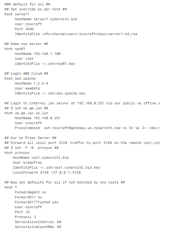

# Cấu hình SSH

## Các Tham Số Cấu Hình SSH

### Host
Xác định máy chủ hoặc các máy chủ mà phần cấu hình áp dụng. Phần kết thúc bằng một phần Máy chủ mới hoặc phần cuối của tệp. Một phần đơn lẻ `*` làm mẫu có thể được sử dụng để cung cấp mặc định toàn cục cho tất cả các máy chủ.

### HostName
Chỉ định tên máy chủ thực để đăng nhập. Địa chỉ IP số cũng được phép.

### User
Xác định tên người dùng cho kết nối SSH.

### IdentityFile
Chỉ định một tệp mà danh tính xác thực DSA, ECDSA hoặc DSA của người dùng được đọc. Mặc định là:
- `~/.ssh/identity` cho phiên bản giao thức 1
- `~/.ssh/id_dsa`, `~/.ssh/id_ecdsa`, và `~/.ssh/id_rsa` cho phiên bản giao thức 2

Tùy chọn `IdentityFile` trong cấu hình SSH hoặc tại CLI tham chiếu đến tệp khóa riêng, phải được giữ bí mật.

### ProxyCommand
Chỉ định lệnh sử dụng để kết nối với máy chủ. Chuỗi lệnh kéo dài đến cuối dòng và được thực thi bằng shell của người dùng. Trong chuỗi lệnh:
- `%h` sẽ được thay thế bằng tên máy chủ để kết nối
- `%p` bằng cổng
- `%r` bằng tên người dùng từ xa

Lệnh về cơ bản có thể là bất kỳ thứ gì và nên đọc từ đầu vào chuẩn của nó và ghi vào đầu ra chuẩn của nó. Chỉ thị này hữu ích khi kết hợp với proxy. Ví dụ: chỉ thị sau sẽ kết nối qua proxy HTTP tại `192.1.0.253`:

```sh
ProxyCommand /usr/bin/nc -X connect -x 192.1.0.253:3128 %h %p
```

### LocalForward
Chỉ định rằng một cổng TCP trên máy cục bộ được chuyển tiếp qua kênh bảo mật đến máy chủ và cổng được chỉ định từ máy từ xa. Đối số đầu tiên phải là `[bind_address:]port` và đối số thứ hai phải là `host:hostport`.

### Port
Chỉ định số cổng để kết nối trên máy chủ từ xa.

### Protocol
Chỉ định các phiên bản giao thức `ssh(1)` nên hỗ trợ theo thứ tự ưu tiên. Các giá trị có thể là `1` và `2`.

### ServerAliveInterval
Đặt khoảng thời gian chờ tính bằng giây. Nếu không nhận được dữ liệu nào từ máy chủ, sẽ gửi tin nhắn qua kênh được mã hóa để yêu cầu phản hồi từ máy chủ.

### ServerAliveCountMax
Thiết lập số lượng tin nhắn `server alive` có thể được gửi mà không nhận được bất kỳ tin nhắn nào từ máy chủ. Nếu ngưỡng này đạt đến trong khi tin nhắn `server alive` đang được gửi, SSH sẽ ngắt kết nối khỏi máy chủ, chấm dứt phiên.

## Link Kham Khảo
- [Các thông số trong file config SSH](https://blog.vinahost.vn/cac-thong-so-trong-file-config-ssh/)
- [Tạo file config SSH trên Linux/Unix](https://www.cyberciti.biz/faq/create-ssh-config-file-on-linux-unix/)