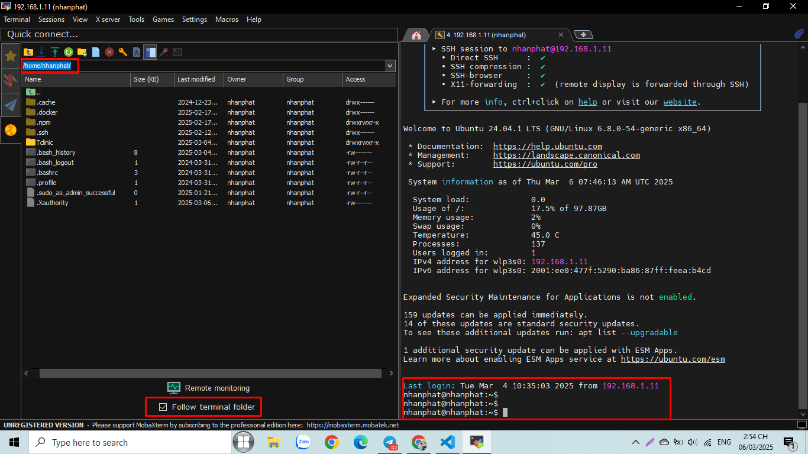

Cài đặt:
https://mobaxterm.mobatek.net/download.html

Tạo một session SSH bất kỳ

Sử dụng scp:
Thông thường khi tạo session thì sẽ mặc định ở chế độ SFTP protocol, mặc dù an toàn hơn nhưng tốc độ tải xuống hoặc upload sẽ chậm hơn bình thường.

Mình sẽ chuyển sang chế độ SCP để tăng tốc độ tải và úp file.

Bây giờ ta login vào session và sử dụng tính năng SCP

Thường thì màn hình của SCP sẽ nằm bên trái, ở dưới hiển thị thư mục và các file, ở trên sẽ là các nút để thực hiện chức năng

1: Nút này dùng để lui về một thư mục trước đó

2: Nút này dùng để download file

3: Nút này dùng để úp file

4: Nút này dùng để refresh vì đôi lúc bạn tạo file ở terminal nhưng trong SCP chưa có file

5: Nút này dùng để tạo thư mục

6: Nút này dùng tạo file

7: Nút này dùng để xóa file

8: Nút này dùng hiển thị các thư mục ẩn, ví dụ như .ssh

Nút follow terminal folder sẽ hiển thị thư mục của SCP theo chỗ đứng SSH - User mà bạn đăng nhập

Sử dụng công cụ theo dõi hệ thống
Ta sẽ chọn vào Remote Monitoring để xem tổng % CPU, %RAM, tốc độ úp file, tốc độ tải file, và dung lượng ổ đĩa đang sử dụng.
