# Thay đổi card mạng trên máy ảo

## 1. Truy cập vào VMWare và Khởi chạy 2 máy ảo:
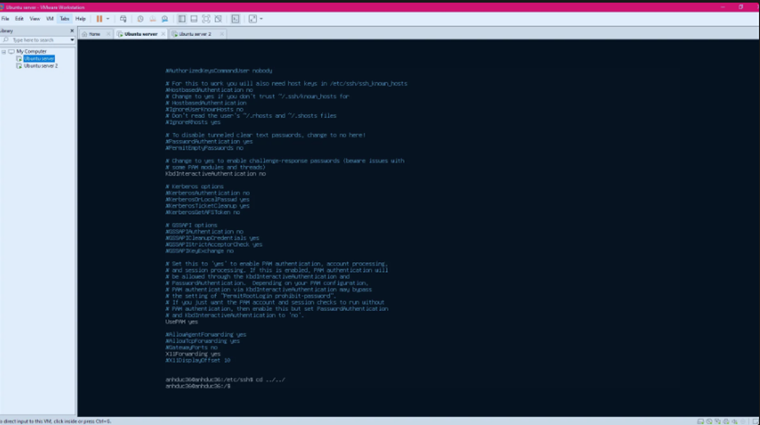

Sau khi đã khởi chạy, để thay đổi thành card mạng host-only, làm như sau:

Chuột phải vào 1 máy ảo bất kì và chọn `Settings`:

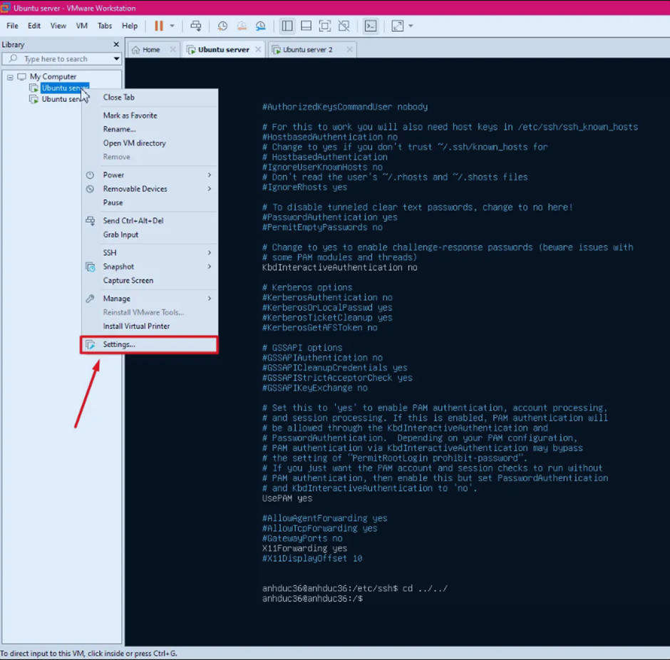

Hiện ra một cửa sổ mới:

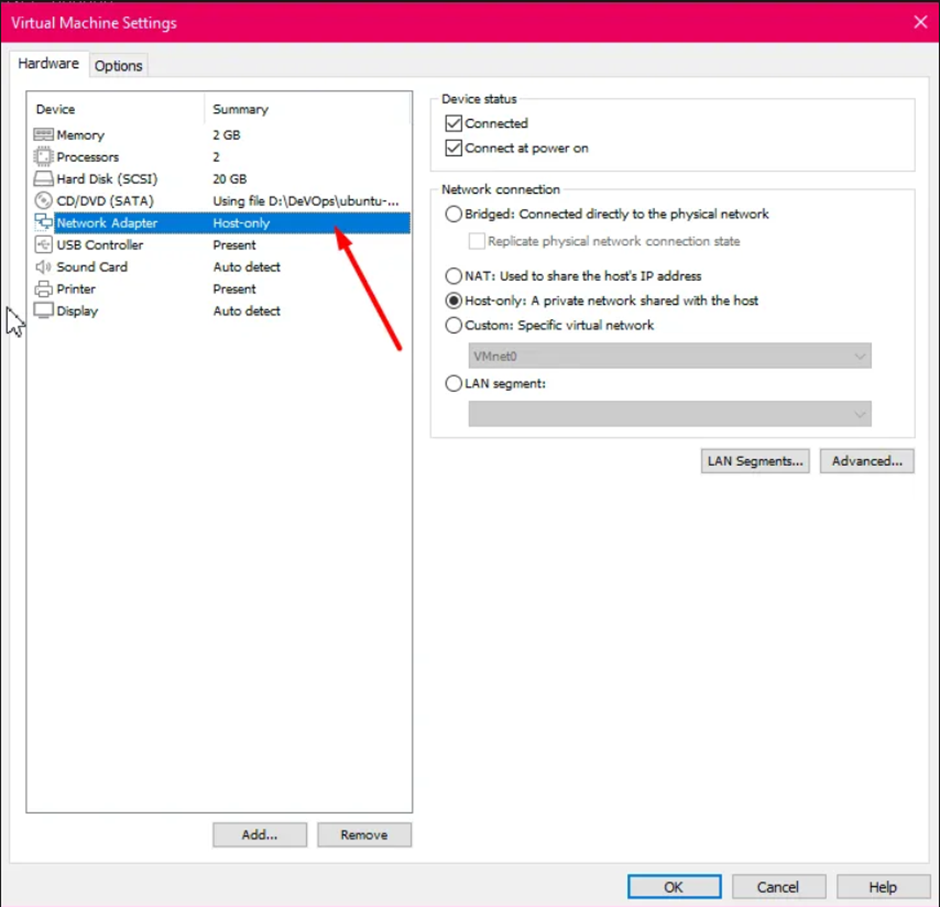

Chọn **Network Adapter**, nếu đang ở chế độ **Host-only** thì nhấn `OK` và thoát.

Còn nếu chưa thì thay đổi ở bên cạnh thành **Host-only**:

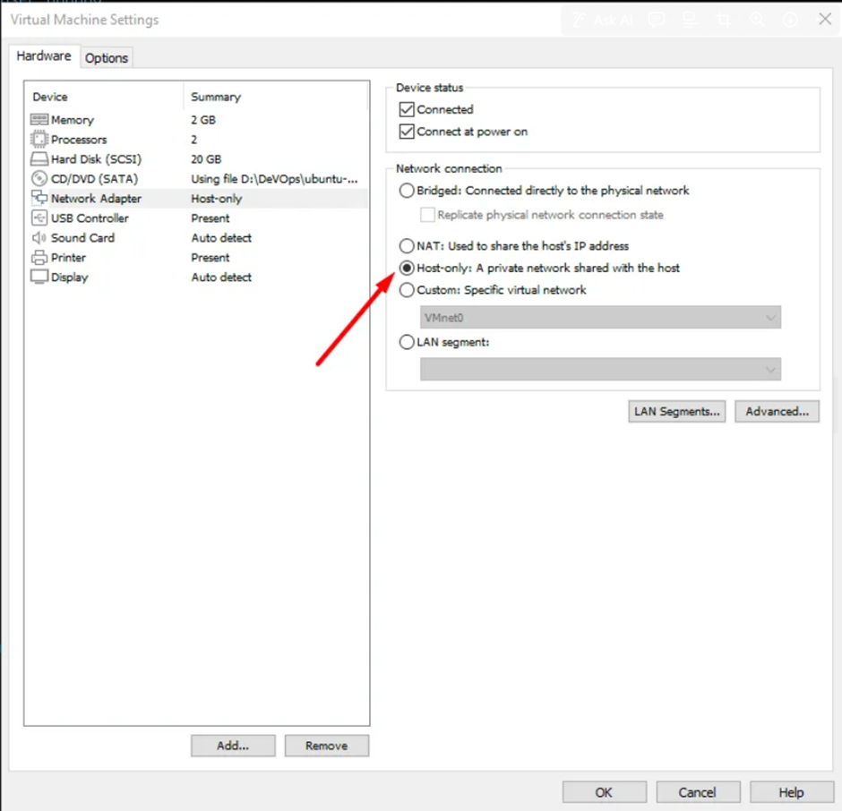

Sau đó nhấn `OK` là xong.

Máy chủ thứ hai làm tương tự.

## 2. Thay đổi khoảng DHCP của máy ảo host-only

### 2.1. Đầu tiên, chạy một máy ảo bất kỳ.

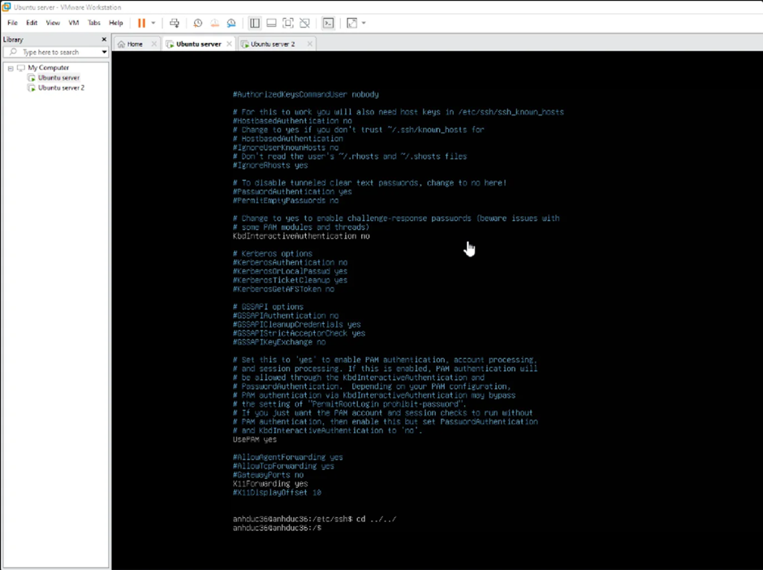

Chọn **Edit**:

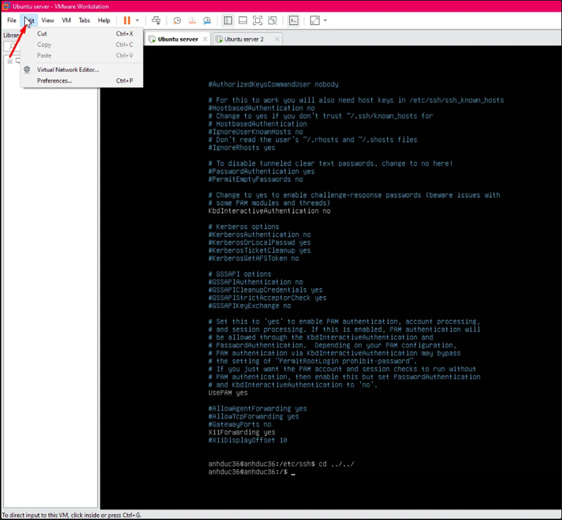

### 2.2. Chọn đến phần **Virtual Network Editor...**

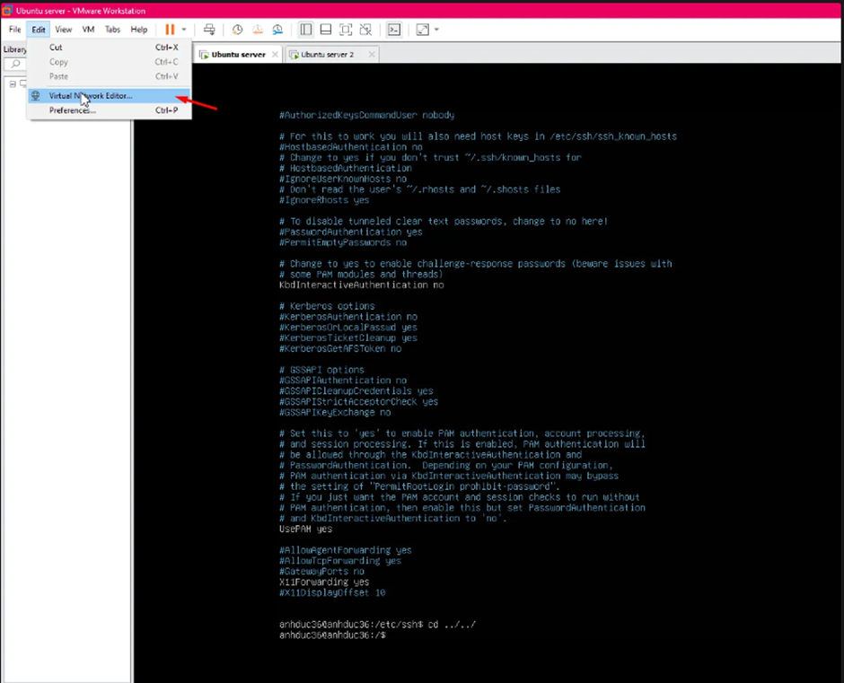

Cửa sổ mới hiện ra:

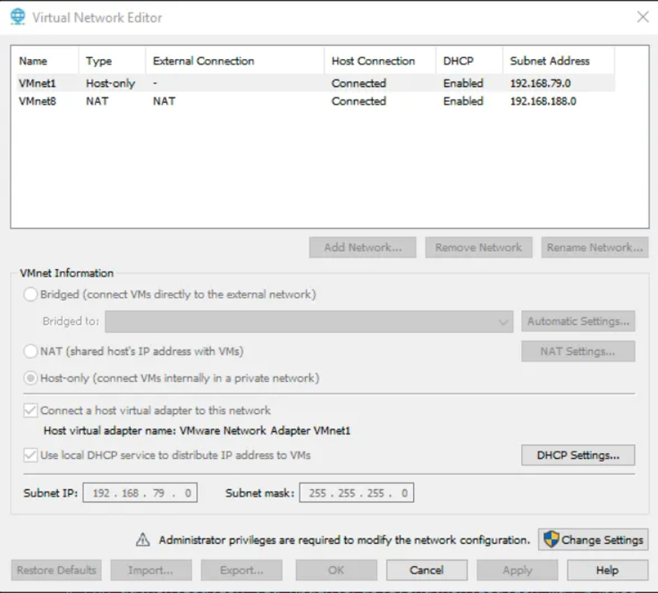

### 2.3. Chọn **Change Settings** để cho phép thay đổi cài đặt.

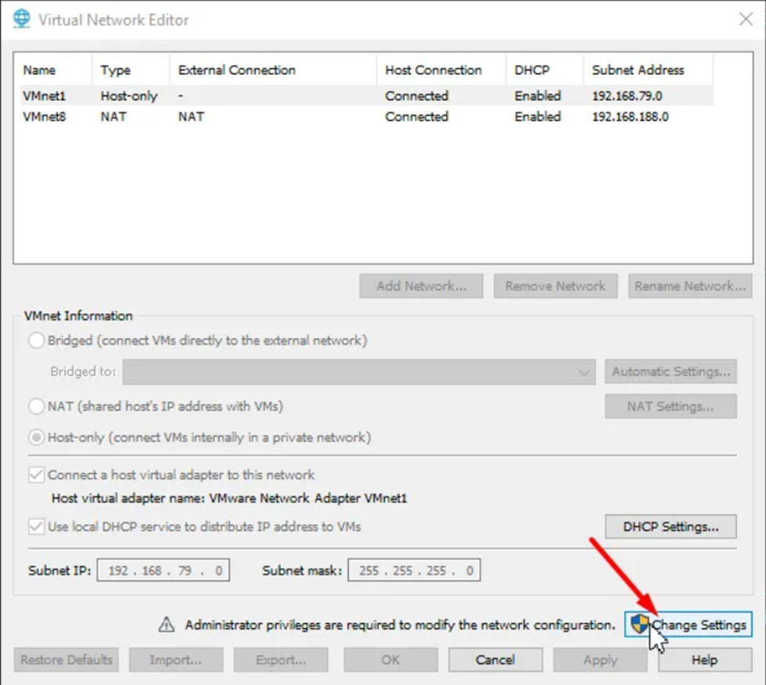

Sau đó vào lại **Virtual Network Editor...**

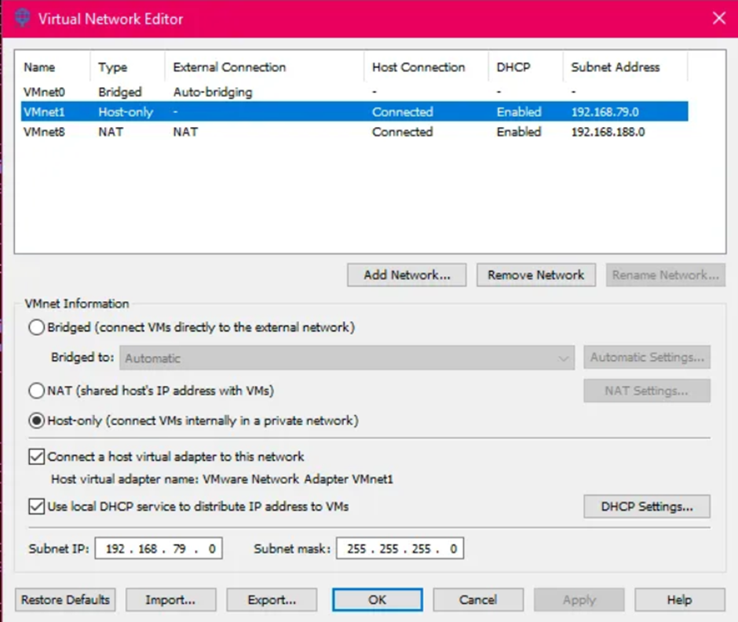

### 2.4. Chọn **DHCP Settings**

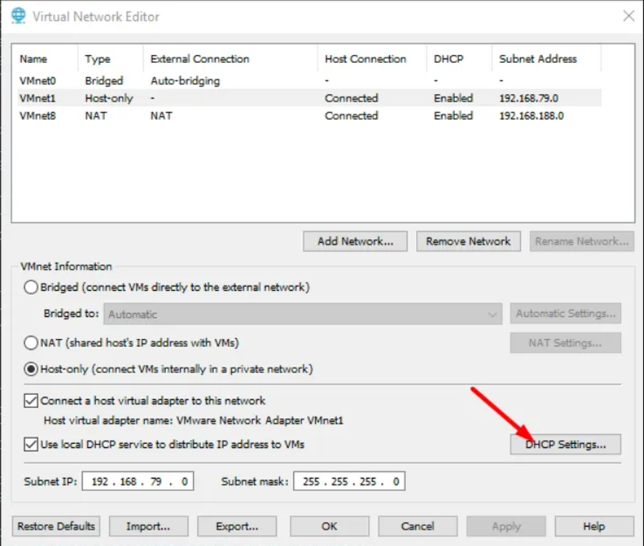

Cửa sổ thay đổi khoảng DHCP hiện ra:

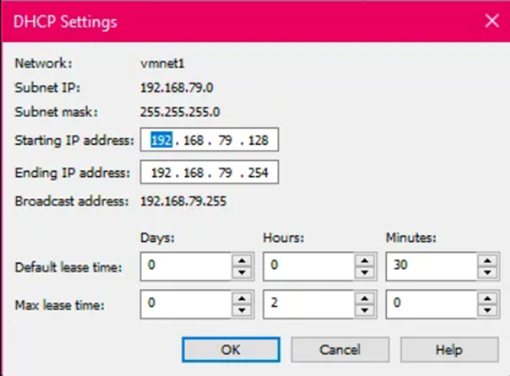

### 2.5. Kiểm tra kết quả

Để kiểm tra, ta sang máy ảo thứ hai và thực hiện `ping` đến địa chỉ IP trong khoảng mới của máy ảo thứ nhất.

## 3. Link tham khảo:
[Hướng dẫn thay đổi card mạng trên VMWare](https://www.youtube.com/watch?v=INVDflOtIYQ)

