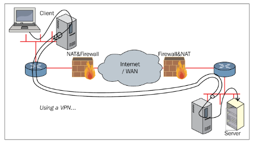
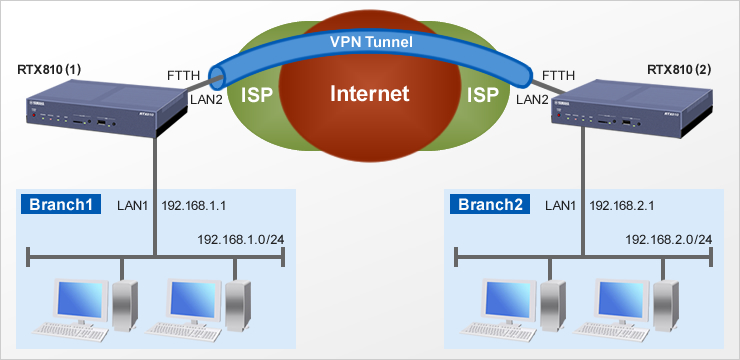
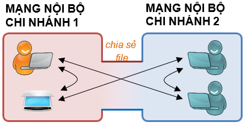
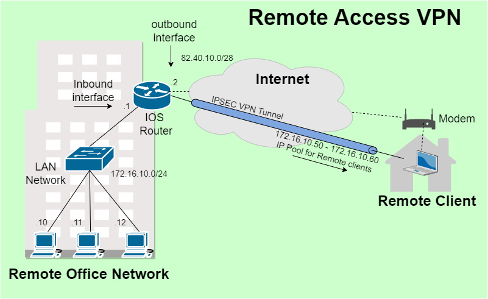
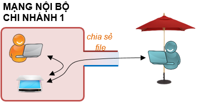
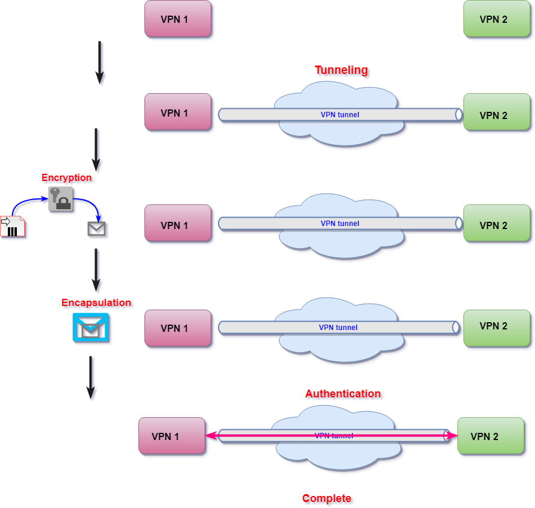
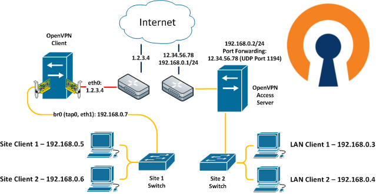

# VPN - Mạng Riêng Ảo

## Mục Lục
- [Giới thiệu VPN](#giới-thiệu-vpn)
- [Ứng dụng và Ưu, Nhược điểm](#ứng-dụng-và-ưu-nhược-điểm)
  - [Ưu điểm](#ưu-điểm)
  - [Nhược điểm](#nhược-điểm)
- [Lợi ích cho Cá nhân và Tổ chức](#lợi-ích-cho-cá-nhân-và-tổ-chức)
- [Phân loại VPN](#phân-loại-vpn)
  - [1. Site-to-Site VPN](#1-site-to-site-vpn)
  - [2. Remote Access VPN (Client-to-Site VPN)](#2-remote-access-vpn-client-to-site-vpn)
- [Các bước chính của quá trình VPN](#các-bước-chính-của-quá-trình-vpn)
- [Các giao thức VPN](#các-giao-thức-vpn)
  - [PPTP](#pptp)
  - [L2TP](#l2tp)
  - [IPSec](#ipsec)
  - [SSL/TLS VPN](#ssltls-vpn)
  - [IKEv2](#ikev2)
  - [WireGuard VPN](#wireguard-vpn)
  - [SSTP](#sstp)
  - [OpenVPN](#openvpn)
- [OpenVPN: Kiến trúc và Ưu điểm](#openvpn-kiến-trúc-và-ưu-điểm)
  - [Lớp hoạt động và Bảo mật](#lớp-hoạt-động-và-bảo-mật)
  - [Tính năng linh hoạt](#tính-năng-linh-hoạt)
  - [Công nghệ mã hóa](#công-nghệ-mã-hóa)
  - [Khả năng vượt qua NAT và Tường lửa](#khả-năng-vượt-qua-nat-và-tường-lửa)
  - [Ưu điểm kinh tế và Dễ sử dụng](#ưu-điểm-kinh-tế-và-dễ-sử-dụng)
  - [Kiến trúc mở và Khả năng mở rộng](#kiến-trúc-mở-và-khả-năng-mở-rộng)
  - [Không phải là Proxy Web](#không-phải-là-proxy-web)
- [OpenVPN Client và Access Server](#openvpn-client-và-access-server)
  - [OpenVPN Client](#openvpn-client)
  - [OpenVPN Access Server](#openvpn-access-server)
  - [Mục tiêu](#mục-tiêu)
- [Khám phá](#khám-phá)

---

## Giới thiệu VPN

**VPN (Virtual Private Network - Mạng riêng ảo)** tạo ra một "đường hầm" mã hóa trên Internet, cho phép các máy tính kết nối một cách an toàn và tiết kiệm chi phí. Cụ thể:

- **Mở rộng mạng riêng qua Internet:** VPN cho phép người dùng truy cập vào mạng nội bộ (LAN) của công ty từ bên ngoài mà vẫn giữ được an ninh của hệ thống.
- **Truyền dữ liệu an toàn:** Dù dữ liệu truyền qua Internet, nó vẫn được mã hóa để bảo vệ thông tin.
- **Truyền mọi loại dữ liệu:** Hỗ trợ truyền tải nhiều loại dữ liệu như voice, video, và thông tin số.

VPN sử dụng kỹ thuật **tunneling** – đóng gói một gói dữ liệu bên trong một gói khác – để tạo ra một kênh truyền an toàn. Các gói tin được bao bọc thêm thông tin định tuyến và mã hóa, chỉ có thể giải mã với khóa thích hợp. Điều này ngăn chặn việc dữ liệu bị truy cập trái phép trong quá trình truyền tải.

---

## Ứng dụng và Ưu, Nhược điểm

### Ưu điểm
- **Truy cập mạng doanh nghiệp từ xa:**  
  Cho phép người kinh doanh truy cập toàn bộ tài nguyên mạng nội bộ (LAN) khi đi công tác, du lịch… mà không để lộ trực tiếp ra Internet, tăng cường bảo mật.
- **Truy cập mạng gia đình từ xa:**  
  Thiết lập VPN riêng giúp truy cập máy tính, tập tin, hoặc chơi game qua Internet như đang kết nối trong cùng mạng LAN.
- **Duyệt web ẩn danh:**  
  Khi sử dụng WiFi công cộng, VPN mã hóa dữ liệu, bảo vệ thông tin khi duyệt web, đặc biệt trên các trang không https.
- **Vượt tường lửa và hạn chế địa lý:**  
  VPN cho phép truy cập các website bị chặn, kiểm duyệt, hoặc bị giới hạn theo khu vực.
- **Tải tập tin hiệu quả:**  
  Sử dụng VPN khi tải BitTorrent giúp tăng tốc độ và vượt qua hạn chế traffic của ISP.

### Nhược điểm
- VPN không quản lý QoS qua Internet, nên các gói dữ liệu có thể thất lạc.
- Khả năng quản lý của nhà cung cấp VPN cũng hạn chế, làm tăng nguy cơ bị tấn công.

---

## Lợi ích cho Cá nhân và Tổ chức

- **Bảo vệ quyền riêng tư:** Ẩn IP và mã hóa hoạt động trực tuyến (dù không hoàn hảo do các công nghệ khác như cookie, fingerprinting).
- **Truyền dữ liệu an toàn:** Đảm bảo dữ liệu nhạy cảm không bị rò rỉ.
- **Truy cập nội dung hạn chế:** Vượt qua giới hạn địa lý, cho phép truy cập nội dung bị chặn.
- **Tuân thủ quy định:** Tạo kết nối an toàn khi làm việc với đối tác quốc tế.

---

## Phân loại VPN

VPN là khái niệm chung chỉ việc thiết lập kênh truyền ảo, nhưng tùy vào mô hình mạng và nhu cầu sử dụng mà người ta có thể chọn loại thiết kế phù hợp. Công nghệ VPN được chia thành 2 loại cơ bản:

### 1. Site-to-Site VPN

- Dùng để kết nối các mạng ở các địa điểm khác nhau thành một hệ thống thống nhất.
- Các thiết bị đầu cuối (gateway) ở mỗi site thực hiện chứng thực, đóng gói và mã hóa dữ liệu trước khi gửi qua đường hầm VPN trên Internet tới gateway đối diện.
- Các host trong mạng không biết về quá trình VPN và vẫn giao tiếp TCP/IP như bình thường.
- Phù hợp để kết nối giữa các văn phòng của cùng một công ty.

### 2. Remote Access VPN (Client-to-Site VPN)

- Cho phép người dùng từ xa (như nhân viên làm việc lưu động, làm việc tại nhà hay văn phòng nhỏ) truy cập an toàn vào mạng nội bộ của công ty.
- Người dùng cài đặt phần mềm VPN Client để kết nối đến VPN Server (hoặc concentrator) qua giao thức tạo tunnel.
- Ngoài ra, có phiên bản wireless VPN giúp truy cập qua kết nối không dây, qua trạm wireless trước khi vào mạng công ty.

Với hai mô hình trên, VPN giúp xây dựng kênh truyền an toàn và bảo mật dữ liệu tùy theo mục đích kết nối.

## Các bước chính của quá trình VPN

    A[Khởi tạo kết nối qua VPN Client] --> B[Xác thực (username/password, key)]
    B --> C[Thiết lập đường hầm an toàn (Tunneling)]
    C --> D[Đóng gói dữ liệu (Encapsulation)]
    D --> E[Mã hóa dữ liệu (Encryption)]
    E --> F[Truyền dữ liệu qua mạng công cộng]
    F --> G[Giải đóng gói & Giải mã dữ liệu]
    G --> H[Truyền dữ liệu gốc đến đích]

**Giải thích các bước:**
- **Khởi tạo kết nối:** Người dùng khởi động VPN Client.
- **Xác thực:** Máy chủ kiểm tra thông tin đăng nhập.
- **Thiết lập đường hầm:** Tạo một kết nối an toàn giữa thiết bị và máy chủ.
- **Đóng gói dữ liệu:** Dữ liệu được đóng gói trong giao thức VPN.
- **Mã hóa dữ liệu:** Bảo vệ thông tin bằng các thuật toán mã hóa.
- **Truyền tải:** Dữ liệu mã hóa được gửi qua mạng công cộng.
- **Giải đóng gói & Giải mã:** Máy chủ VPN xử lý dữ liệu nhận được.
- **Truyền dữ liệu gốc:** Dữ liệu gốc được chuyển đến đích cuối cùng.

---

## Các giao thức VPN

### PPTP
- **Mô tả:** Giao thức VPN truyền thống, dễ thiết lập và phổ biến trên nhiều nền tảng.
- **Mã hóa:** Sử dụng MPPE 128-bit.
- **Ưu điểm:** Cấu hình đơn giản, kết nối nhanh.
- **Nhược điểm:** Bảo mật cơ bản, dễ bị tấn công, không tương thích tốt với NAT.

### L2TP
- **Mô tả:** Thường kết hợp với IPSec để tăng cường bảo mật, tạo đường hầm giữa hai điểm.
- **Mã hóa:** Dùng IPsec (AES, 3DES).
- **Ưu điểm:** An toàn hơn PPTP.
- **Nhược điểm:** Tốc độ chậm hơn do quá trình đóng gói kép, có thể bị chặn bởi firewall.

### IPSec
- **Mô tả:** Bộ giao thức bảo mật tầng IP, sử dụng AH và ESP để xác thực và mã hóa từng gói tin.
- **Ưu điểm:** Bảo mật cao, phù hợp với VPN site-to-site.
- **Nhược điểm:** Cấu hình phức tạp, không tương thích tốt với NAT.

### SSL/TLS VPN
- **Mô tả:** Sử dụng giao thức SSL/TLS (HTTPS) cho phép truy cập an toàn qua trình duyệt.
- **Mã hóa:** Thường dùng AES.
- **Ưu điểm:** Dễ sử dụng, không cần cài đặt phần mềm client.
- **Nhược điểm:** Giới hạn cho các ứng dụng web, kiểm soát bảo mật hạn chế.

### IKEv2
- **Mô tả:** Giao thức VPN cung cấp tốc độ và bảo mật cao, lý tưởng cho thiết bị di động.
- **Mã hóa:** Thường sử dụng AES.
- **Ưu điểm:** Kết nối lại nhanh, bảo mật mạnh.
- **Nhược điểm:** Hỗ trợ hạn chế, có thể bị chặn bởi tường lửa.

### WireGuard VPN
- **Mô tả:** Giao thức mới, nổi bật nhờ tính đơn giản và tốc độ nhanh.
- **Mã hóa:** Sử dụng ChaCha20 và Poly1305.
- **Ưu điểm:** Hiệu quả cao, sử dụng công nghệ mã hóa hiện đại.
- **Nhược điểm:** Chưa được hỗ trợ rộng rãi do còn tương đối mới.

### SSTP
- **Mô tả:** Giao thức của Microsoft sử dụng SSL/TLS (HTTPS) để thiết lập kết nối an toàn, hoạt động chủ yếu trên Windows.
- **Mã hóa:** Dùng SSL/TLS với AES.
- **Ưu điểm:** Bảo mật cao, dễ vượt qua tường lửa.
- **Nhược điểm:** Hạn chế về nền tảng và không mã nguồn mở.

### OpenVPN
- **Mô tả:** Giao thức mã nguồn mở, linh hoạt, bảo mật cao với khả năng cấu hình đa dạng.
- **Mã hóa:** Sử dụng AES-256.
- **Ưu điểm:** An toàn, hỗ trợ nhiều nền tảng.
- **Nhược điểm:** Cấu hình phức tạp hơn so với các giao thức khác.

---

## OpenVPN: Kiến trúc và Ưu điểm

### Lớp hoạt động và Bảo mật
- OpenVPN hoạt động ở lớp 2 (liên kết dữ liệu) và lớp 3 (mạng), sử dụng các chuẩn bảo mật của SSL/TLS để thiết lập kênh truyền an toàn. Nhờ đó, dữ liệu truyền qua Internet được mã hóa, bảo vệ thông tin khỏi bị rò rỉ hay can thiệp.

### Tính năng linh hoạt
- Hỗ trợ nhiều hình thức VPN như truy cập từ xa (remote access), kết nối giữa các văn phòng (site-to-site), bảo mật kết nối Wifi và các giải pháp truy cập từ xa khác. Người dùng có thể cấu hình theo nhiều cách khác nhau: sử dụng khóa chia sẻ trước, chứng chỉ số đến xác thực bằng tên người dùng/mật khẩu.

### Công nghệ mã hóa
- OpenVPN sử dụng thư viện OpenSSL để thực hiện mã hóa và giải mã dữ liệu, cho phép áp dụng nhiều thuật toán mã hóa mạnh mẽ như AES, Blowfish… Điều này đảm bảo an toàn tối đa cho dữ liệu khi truyền qua Internet.

### Khả năng vượt qua NAT và Tường lửa
- Nhờ sử dụng giao thức UDP hoặc TCP, OpenVPN có thể dễ dàng hoạt động qua các mạng có NAT, tường lửa hoặc proxy, giúp thiết lập kết nối ổn định ngay cả trong môi trường mạng hạn chế.

### Ưu điểm kinh tế và Dễ sử dụng
- OpenVPN là giải pháp chi phí thấp, phù hợp với các doanh nghiệp nhỏ và vừa (SME) cũng như các tổ chức. So với các công nghệ VPN khác, nó giảm bớt sự phức tạp trong quá trình triển khai mà vẫn đảm bảo mức độ bảo mật cao.

### Kiến trúc mở và Khả năng mở rộng
- Là phần mềm mã nguồn mở, OpenVPN cho phép người dùng tùy chỉnh và mở rộng thông qua các plugin, script hay tích hợp với các hệ thống xác thực (như LDAP, RADIUS). Nó cung cấp giao thức bảo mật tùy chỉnh, hỗ trợ cả quản lý đa khách hàng lẫn phát hành chứng chỉ riêng cho từng client.

### Không phải là Proxy Web
- OpenVPN không hoạt động qua trình duyệt web mà được cài đặt như một ứng dụng độc lập trên máy tính hoặc thiết bị di động.

---

## OpenVPN Client và Access Server

### OpenVPN Client
- Máy này có địa chỉ IP công cộng (ví dụ: `1.2.3.4`) hoặc nằm sau một router NAT.
- OpenVPN Client được cấu hình kiểu **bridging (cầu nối):**
  - Giao diện ảo `tap0` được ghép (bridge) với giao diện vật lý (ví dụ: `eth1`), tạo thành `br0` có địa chỉ IP nội bộ (ví dụ: `192.168.0.7`).
  - Nhờ bridge này, các máy trong LAN bên trái (Site Client 1, Site Client 2) sử dụng dải mạng `192.168.0.x` có thể “thấy” được tunnel OpenVPN như thể chúng đang ở cùng một mạng.

### OpenVPN Access Server
- Máy chủ này nằm trong mạng nội bộ `192.168.2.0/24`.
- Để máy chủ có thể nhận kết nối từ Internet, router/NAT phía trước thực hiện **Port Forwarding UDP** cổng `1194` (cổng mặc định của OpenVPN) từ địa chỉ công cộng (ví dụ: `12.34.56.78`) đến máy chủ Access Server.
- Tại đây, Access Server cung cấp dịch vụ VPN, cho phép các Client từ xa kết nối vào, tạo kênh truyền an toàn.

### Mục tiêu
- Các máy tính ở mạng bên trái (dải `192.168.0.x`) thông qua OpenVPN Client sẽ tạo một đường hầm mã hóa với OpenVPN Access Server bên phải (dải `192.168.2.x`).
- Nhờ vậy, các thiết bị ở hai mạng nội bộ (`192.168.0.x` và `192.168.2.x`) có thể trao đổi dữ liệu như thể đang ở chung một mạng LAN, trong khi tất cả lưu lượng qua Internet đều được mã hóa an toàn.

---

## Khám phá

- [200lab.io - VPN là gì? Giải thích cách hoạt động VPN](https://200lab.io/blog/vpn-la-gi-giai-thich-cach-hoat-dong-vpn#tam-quan-trong-cua-vpn)
- [Github - Tài liệu tổng quan VPN (OpenVPN)](https://github.com/hocchudong/thuctap012017/blob/master/TamNT/VPN-OpenVPN/docs/1.Tong_quan_VPN_(VPN_overview).md#1.1)
