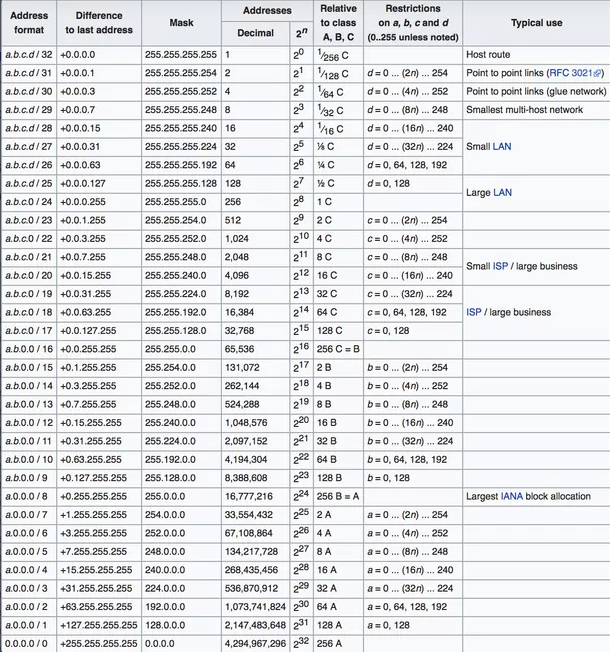

# CIDR - Phương pháp phân chia mạng linh hoạt và hiệu quả

## Mục lục

1. [Address format](#address-format)
2. [Difference to last address](#difference-to-last-address)
3. [Mask](#mask)
4. [Addresses](#addresses)
5. [Decimal](#decimal)
6. [Relative to classes A, B, C](#relative-to-classes-a-b-c)
7. [Restrictions on (n, b, and h)](#restrictions-on-n-b-and-h)
8. [Typical use](#typical-use)
9. [Kết Luận](#kết-luận)
10. [Cách biểu diễn địa chỉ IP và ý nghĩa của "/24"](#cách-biểu-diễn-địa-chỉ-ip-và-ý-nghĩa-của-24)

## Address format
Cột này hiển thị dạng "a.b.c.d/xx" (hoặc chỉ /xx).
Số "/xx" biểu thị prefix length (độ dài tiền tố mạng), tức số bit dùng cho phần mạng.
Ví dụ: "/24" nghĩa là có 24 bit dành cho mạng, còn 8 bit cuối dành cho host.

## Difference to last address
Đây thường được gọi là "block size" hoặc "step" của subnet.
Nó cho biết khoảng cách giữa địa chỉ mạng (network address) đầu tiên và địa chỉ kế tiếp.
Chẳng hạn, /24 có "block size" là 256. Tức là nếu mạng bắt đầu ở 192.168.1.0/24, thì mạng kế tiếp cùng kích thước sẽ là 192.168.2.0/24.

## Mask
Đây là subnet mask dưới dạng thập phân chấm (dotted decimal).
Ví dụ: /24 tương đương với 255.255.255.0, /16 tương đương 255.255.0.0, v.v.

## Addresses
Cột này chỉ tổng số địa chỉ IP nằm trong subnet.
Công thức chung: số địa chỉ = 2^(32 – prefix_length).
Ví dụ: /24 có 2^(32 – 24) = 2^8 = 256 địa chỉ.

## Decimal
Thường là giá trị 2^(32 – n) được liệt kê để tiện theo dõi, hoặc có thể là biểu diễn khác của số địa chỉ.

## Relative to classes A, B, C
Đây là cột so sánh với classful (Class A, B, C) truyền thống.
Ví dụ, Class A có prefix mặc định /8, Class B có /16, Class C có /24.

## Restrictions on (n, b, and h)
Những hạn chế khi chia subnet:
- n: số bit mạng (network bits)
- b: số bit subnet (subnet bits, "borrowed bits")
- h: số bit host (host bits)

## Typical use
Các trường hợp sử dụng phổ biến:
- Point-to-point links: /30, /31, /32.
- Small LAN: /29, /28, /27.
- Large LAN: /24, /23.
- ISP / doanh nghiệp: /20, /19.
- Largest IANA multi-block allocation: /8, /9.

## Kết Luận
- **Prefix (CIDR)**: Ký hiệu dạng "/n" (ví dụ /24).
- **Subnet Mask**: Biểu diễn dưới dạng thập phân chấm.
- **Số địa chỉ**: Tổng số IP trong mỗi subnet.
- **Block size (Difference)**: Khoảng nhảy giữa các mạng liên tiếp.

### Ứng dụng thường gặp
- /30, /31, /32 cho kết nối điểm - điểm, loopback.
- /29, /28, /27 cho mạng LAN nhỏ.
- /24, /23, /22 cho mạng LAN lớn hoặc ISP.

### Cách biểu diễn địa chỉ IP và ý nghĩa của "/24"
Cách biểu diễn thay thế:

Viết địa chỉ IP cùng với mặt nạ mạng dưới dạng dotted-decimal:
Ví dụ: 192.168.111.62 255.255.255.0
Đây là cách biểu diễn tương đương với 192.168.111.62/24.
Ý nghĩa của "/24":

/24 là phần CIDR notation (Classless Inter-Domain Routing) chỉ ra rằng 24 bit đầu tiên của địa chỉ IP là phần dành cho network (mạng).
Điều này tương đương với mặt nạ mạng 255.255.255.0 (vì 255.255.255.0 có 24 bit 1).

VD
255.255.255.0 là dạng subnet mask (mặt nạ mạng) phổ biến trong IPv4, thường được gọi là /24 trong ký hiệu CIDR.

1:Dạng nhị phân
255.255.255.0 tương đương với 11111111.11111111.11111111.00000000 (mỗi số 255 là 8 bit 1).
24 bit đầu (3 octet đầu) là phần mạng, 8 bit cuối là phần host.

2:Địa chỉ mạng và broadcast
Ví dụ, nếu IP của bạn là 192.168.1.10/24, thì:
Địa chỉ mạng (network address): 192.168.1.0 (tất cả bit host bằng 0)
Địa chỉ broadcast: 192.168.1.255 (tất cả bit host bằng 1)

3:Số địa chỉ IP trong mạng
Với /24, tổng số địa chỉ trong subnet là 2^(32 – 24) = 2^8 = 256 địa chỉ.
Địa chỉ đầu là network address, địa chỉ cuối là broadcast, do đó có 254 địa chỉ khả dụng cho các thiết bị (host).

4:Ứng dụng phổ biến
Thường dùng trong các mạng LAN (Local Area Network) quy mô vừa và nhỏ.
Đây cũng là “mặc định” cho mạng Class C trong mô hình cũ (classful), nhưng trong thực tế CIDR, nó được áp dụng linh hoạt cho mọi mạng.

