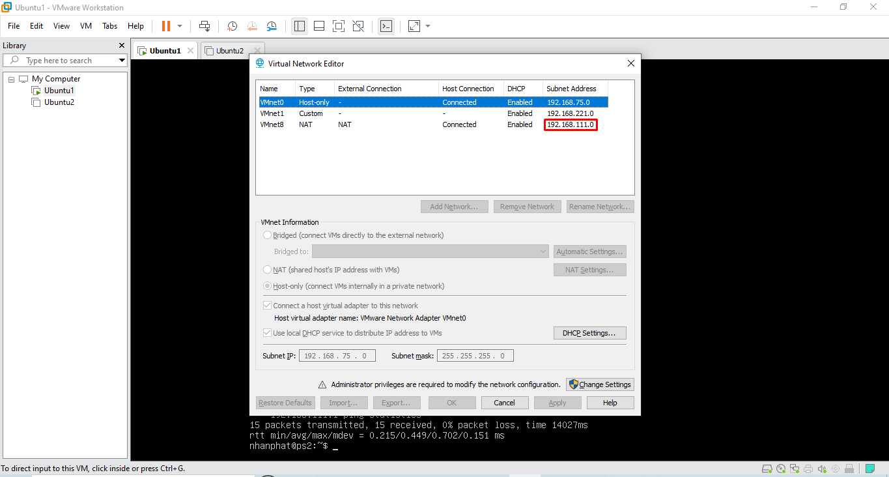
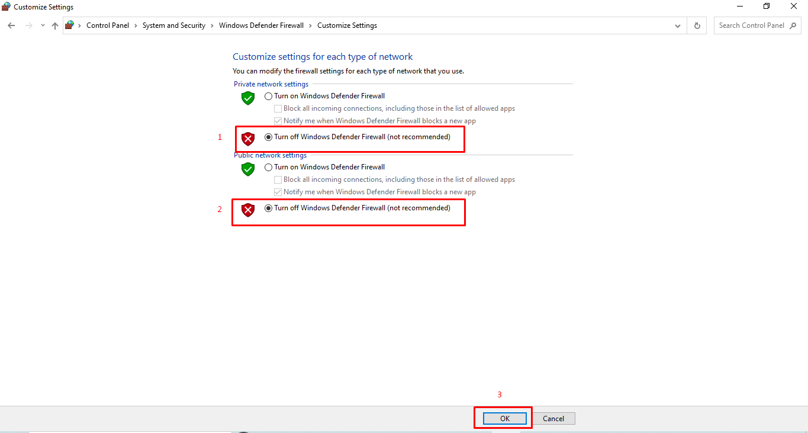
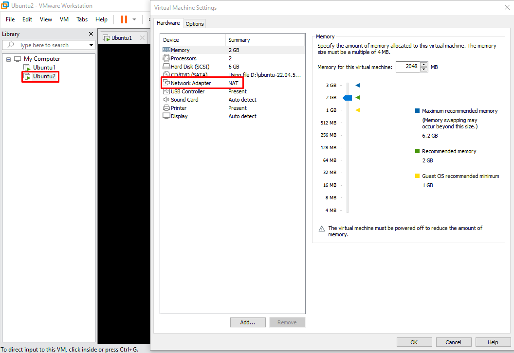

TH1: Ping máy ảo gắn card NAT đến máy tính vật lí

bật terminal

xác định ip card Host-Only

truy cập tường lửa

tắt tường lửa

sau đó restart lại máy

ping từ máy ảo đến máy tính vật lí

Th2:ping 2 máy ảo host-only và máy ảo NAT trên cùng 1 máy vật lý

Cài đặt máy ảo gắn card Host-Only

Cài đặt máy ảo gắn card NAT

xác định ip của 2 máy ảo gắn card NAT- card Host-only

ping Card Host-only sang card Nat: không thành công

ping Card Nat sang card Host-only: thành công
