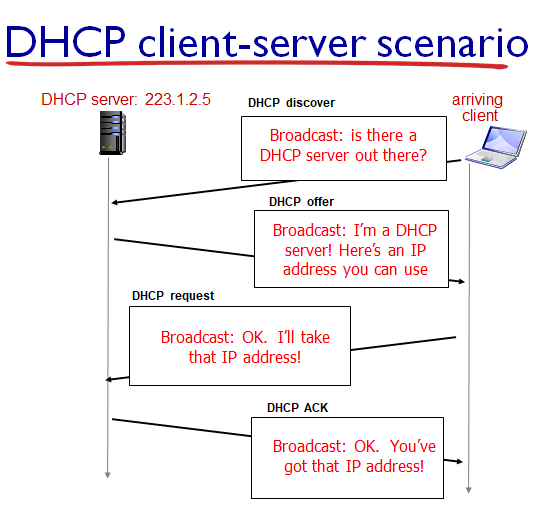
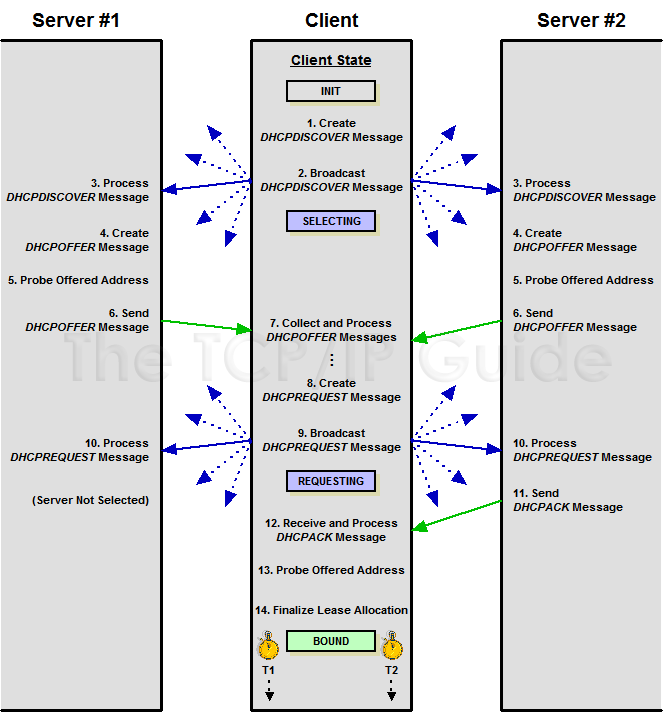
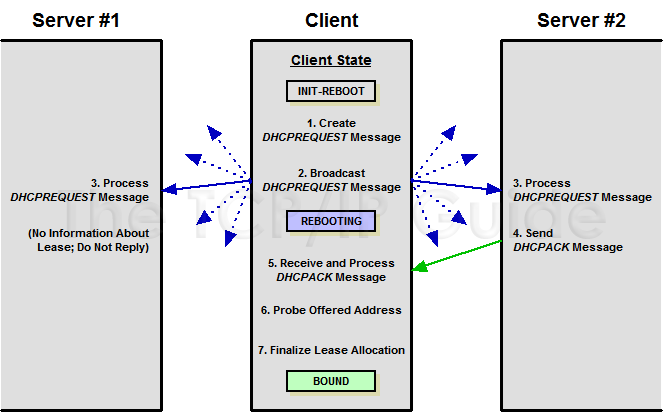
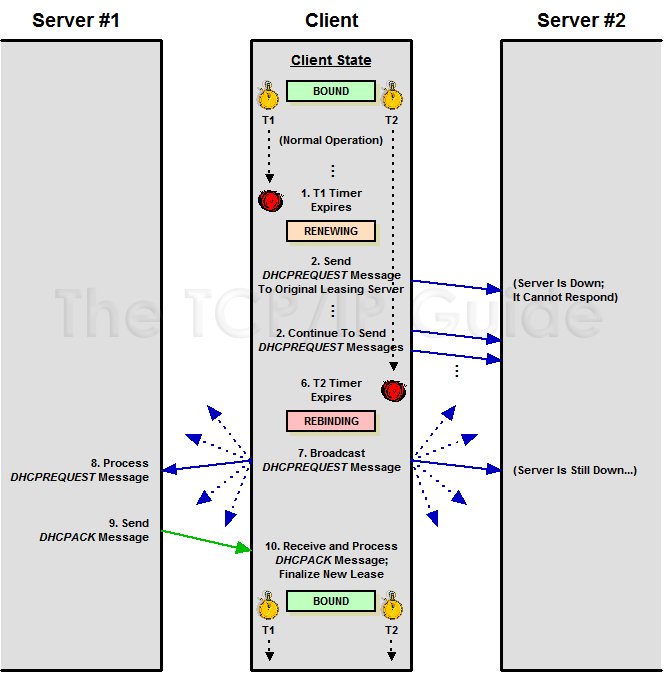
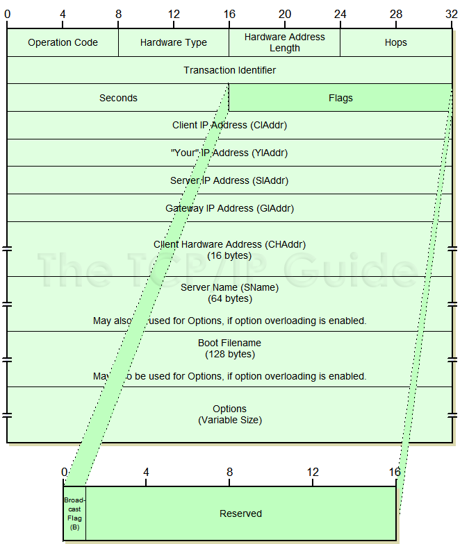

# **DHCP: Giao Thức Cấu Hình Động Địa Chỉ IP**  

## **1. DHCP là gì?**  
DHCP (Dynamic Host Configuration Protocol) là một giao thức mạng giúp tự động cấp phát địa chỉ IP và các thông tin cấu hình mạng khác cho các thiết bị trong hệ thống. Thay vì phải gán địa chỉ IP bằng tay (tĩnh), DHCP giúp quản lý IP động, giảm công việc thủ công và tránh xung đột địa chỉ IP.

Quá trình cấp phát địa chỉ IP (Lease Allocation)

Client gửi bản tin DHCP DISCOVER (Broadcast).

DHCP Server gửi bản tin DHCP OFFER.

Client phản hồi bằng DHCP REQUEST để chấp nhận.

DHCP Server gửi DHCP ACK, hoàn tất cấp phát IP.

## **2. Các loại bản tin DHCP**  

Loại bản tin	Chức năng
DHCP DISCOVER	Client gửi yêu cầu tìm DHCP Server.
DHCP OFFER	    Server phản hồi với một địa chỉ IP có sẵn.
DHCP REQUEST	Client xác nhận muốn sử dụng địa chỉ IP được cung cấp.
DHCP ACK	    Server xác nhận và cấp phát địa chỉ IP chính thức.
DHCP NAK	    Server từ chối cấp địa chỉ IP.
DHCP DECLINE	Client từ chối địa chỉ IP do bị trùng lặp.
DHCP RELEASE	Client trả lại địa chỉ IP cho Server.
DHCP INFORM	    Client yêu cầu thông tin cấu hình khác ngoài địa chỉ IP.
5. **DHCP NAK (Thông Báo Từ Chối Cấp IP)**
    - Từ chối cấp phát IP, buộc Client phải xin lại IP mới.
🔹 Ví dụ:

Máy tính A nhận IP 192.168.1.100 với Lease Time là 24 giờ. Sau 24 giờ, nếu không gia hạn được và cố sử dụng IP này, DHCP Server có thể gửi DHCP NAK, buộc A phải lấy IP mới.

6. **DHCP DECLINE (Từ Chối Địa Chỉ IP Do trùng lặp)**
    - Từ chối sử dụng IP và yêu cầu IP khác.
🔹 Ví dụ:

Máy tính B được cấp IP 192.168.1.101. Khi kiểm tra, B phát hiện rằng địa chỉ này đã được sử dụng bởi một thiết bị khác. B sẽ gửi DHCP Decline để yêu cầu IP khác.

7. **DHCP RELEASE (Trả lại Địa Chỉ IP)**
    - Giải phóng IP để cấp phát lại.
🔹 Ví dụ:

Máy tính C đang sử dụng IP 192.168.1.102. Khi tắt máy hoặc rời khỏi mạng, nó gửi DHCP Release để giải phóng IP, giúp các thiết bị khác có thể sử dụng IP này.

8. **DHCP INFORM (Yêu Cầu Thông Tin Mạng)**
    - Cung cấp thông số mạng như DNS, Gateway.    
 Ví dụ:

Máy tính D có địa chỉ IP tĩnh là 192.168.1.200 nhưng không biết DNS Server của mạng. D gửi DHCP Inform đến máy chủ DHCP, và máy chủ phản hồi với địa chỉ DNS 8.8.8.8.

## **3. Tiến trình hoạt động của DHCP**  
Quá trình cấp phát địa chỉ IP

Quá trình xin cấp phát lại địa chỉ IP

Quá trình Renew và Rebind

## **4. Đặc điểm DHCP**  
Mô hình Client/Server:
    DHCP Server quản lý và cấp phát địa chỉ IP.
    DHCP Client nhận địa chỉ IP và thông tin cấu hình mạng từ Server.

Giao thức sử dụng:
    DHCP Server lắng nghe trên cổng 67.
    DHCP Client nhận phản hồi từ Server trên cổng 68.

Chức năng chính:
    Cấp phát địa chỉ IP tự động.
    Quản lý tập trung địa chỉ IP.
    Tái sử dụng địa chỉ IP.
    Giảm thiểu xung đột IP.
    Hỗ trợ cấu hình mạng linh hoạt.

Ưu điểm:
✅ Giảm tải công việc quản trị mạng.
✅ Hỗ trợ cấp phát địa chỉ IP động.
✅ Đơn giản hóa cấu hình mạng.
✅ Hỗ trợ mở rộng hệ thống mạng dễ dàng.

## **5. Cơ chế phân bổ địa chỉ của DHCP Server**
DHCP có 3 cơ chế cấp phát địa chỉ IP:

1. Manual Allocation (Cấp phát thủ công)
    Người quản trị gán địa chỉ IP cố định cho từng thiết bị cụ thể.
    Thường dùng cho Server, Router, Printer, Camera IP.

2. Automatic Allocation (Cấp phát tự động)
    DHCP Server tự động gán một địa chỉ IP từ danh sách có sẵn.
    Địa chỉ được cấp sẽ cố định cho Client đó.

3. Dynamic Allocation (Cấp phát động)
    DHCP Server cấp địa chỉ IP theo yêu cầu, nhưng có thời hạn thuê.
    Khi hết hạn, địa chỉ IP có thể được tái sử dụng.

Đây là cơ chế phổ biến nhất hiện nay.

## **6. Vòng đời và thời gian "thuê"  IP của Client**
Quy trình cấp phát và quản lý địa chỉ IP gồm 5 giai đoạn:

1. Allocation (Cấp phát lần đầu)
Một client bắt đầu khi chưa từng thuê IP và do đó chưa có địa chỉ được cấp từ DHCP server. Nó yêu cầu thuê thông qua một quá trình phân bổ Allocation.

2. Reallocation (Cấp phát lại khi khởi động lại)
Nếu client đã có sẵn địa chỉ IP lần thuê hiện tại, và sau đó khi nó khởi động lại sau khi tắt, nó sẽ liên lạc với DHCP server để xác nhận việc thuê và dùng lại các thông số vận hành. Điều này được gọi là Reallocation, nó tương tự như Allocation nhưng ngắn hơn.

3. Normal Operation (Hoạt động bình thường)
Khi một hợp đồng cho thuê đang hoạt động, client được gán vào một địa chỉ mà DHCP server cấp phát, cho thuê.

4. Renewal (Gia hạn địa chỉ IP sau 50% thời gian thuê)
Sau một phần thời gian nhất định của thời gian cho thuê, client sẽ cố gắng liên lạc với máy chủ cho thuê ban đầu, gia hạn thêm hợp đồng để nó có thể tiếp tục sử dụng IP đó sau khi thời gian cho thuê kết thúc (thường sau nửa thời gian được phép sử dụng IP, client sẽ liên lạc với DHCP server để gia hạn thêm hợp đồng)

5. Rebind (Yêu cầu gia hạn từ bất kỳ DHCP Server nào sau 87.5% thời gian thuê)
Nếu việc renewal không thành (giả sử máy server bị tắt), sau đó client sẽ cố gắng kết nối lại với bất kì máy chủ DHCP nào đang hoạt động, cố gắng mở rộng thời gian cho thuê hiện tại.

6. Release
client có thể quyết định ở bất kì thời điểm nào đó nó không còn muốn sử dụng địa chỉ IP được cấp từ DHCP nữa, và có thể chấm dứt hợp đồng cho thuê, giải phóng địa chỉ IP.

## **7. Cấu Trúc Gói Tin DHCP**  

Gói tin DHCP sử dụng giao thức **UDP** trên các cổng:  
- **Cổng 67**: Máy chủ DHCP lắng nghe yêu cầu từ client.  
- **Cổng 68**: Máy khách nhận phản hồi từ máy chủ DHCP.  

### **Cấu trúc gói tin DHCP gồm các phần chính:**  
| Trường | Kích thước (Bytes) | Mô tả |
|--------|--------------------|------|
| **Op Code** | 1 | Loại gói tin (1 = request, 2 = reply) |
| **Hardware Type** | 1 | Loại phần cứng (Ethernet = 1) |
| **Hardware Address Length** | 1 | Độ dài địa chỉ MAC |
| **Hops** | 1 | Số lần chuyển tiếp gói tin |
| **Transaction ID** | 4 | ID để nhận diện yêu cầu |
| **Seconds Elapsed** | 2 | Thời gian trôi qua từ lúc gửi Discover |
| **Flags** | 2 | Bit Broadcast |
| **Client IP Address** | 4 | Địa chỉ IP của Client (nếu có) |
| **Your IP Address** | 4 | Địa chỉ IP DHCP cấp phát |
| **Next Server IP Address** | 4 | Địa chỉ IP của máy chủ kế tiếp |
| **Relay Agent IP Address** | 4 | Địa chỉ IP của bộ chuyển tiếp DHCP |
| **Client MAC Address** | 16 | Địa chỉ MAC của thiết bị |
| **Client Hostname** | 64 | Tên thiết bị |
| **Boot File Name** | 128 | Tên file khởi động (nếu có) |
| **Options** | Tùy biến | Chứa các thông tin mở rộng (DNS, Gateway...) |

## **8. Các Thông Số Quan Trọng Trong DHCP**  

1. **DHCP Lease Time**: Thời gian mà IP được cấp phát. Khi gần hết hạn, thiết bị phải yêu cầu gia hạn.  
2. **Default Gateway**: Địa chỉ của router giúp thiết bị kết nối ra ngoài mạng LAN.  
3. **DNS Server**: Địa chỉ máy chủ DNS giúp phân giải tên miền.  
4. **Subnet Mask**: Xác định phần mạng và phần host của địa chỉ IP.  
5. **Option 66, 67**: Dùng để chỉ định máy chủ TFTP cho các thiết bị cần khởi động từ mạng (PXE Boot).  
6. **Option 82**: Dùng trong các hệ thống mạng lớn, giúp định danh thiết bị yêu cầu DHCP.  

