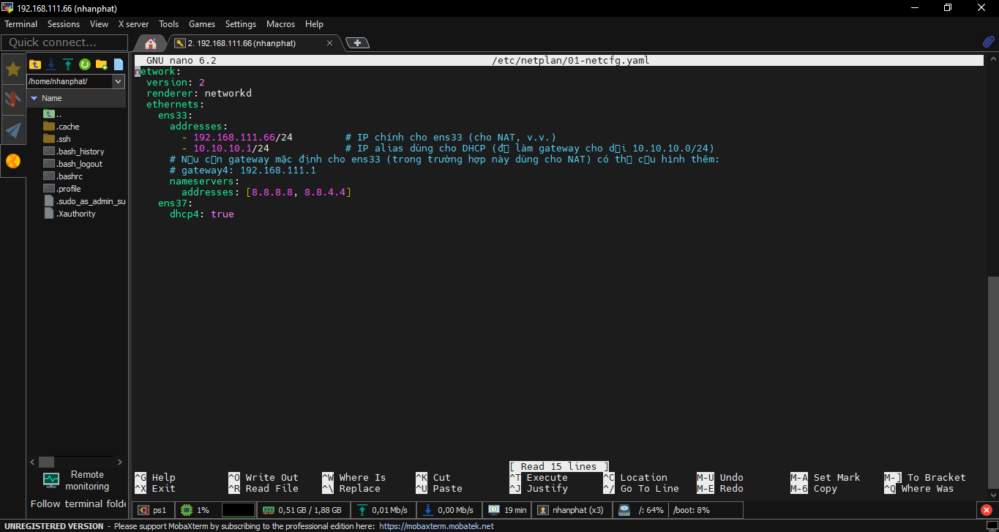

Mô hình Lab thực hiện trên các máy ảo VMware cài hệ điều hành Ubuntu.

Mục đích bài Lab:

Hiểu về mô hình triển khai DHCP.

Cấu hình DHCP cấp phát địa chỉ IP cho các client trong dải mạng VMnet0.

Cấu hình cấp phát IP theo địa chỉ MAC (cấu hình cho máy client 2).

Tắt DHCP cho các máy client sử dụng card Host-Only:

Thêm client :

Chọn card Host-Only:

2.2. Cài đặt DHCP Server
Bước 1: Cài đặt DHCP Server trên Ubuntu
Cập nhật danh sách gói và cài đặt gói isc-dhcp-server:

sudo apt update
sudo apt install isc-dhcp-server -y

Cách kiểm tra đã cài gói isc-dhcp-server:

Bước 2: Cấu hình giao diện cho DHCP Server
Mở file cấu hình DHCP Server:

sudo nano /etc/default/isc-dhcp-server

Tìm dòng:

INTERFACESv4=""

Sửa lại thành:

INTERFACESv4="ens37"

Bước 3: Cấu hình file DHCP Server (/etc/dhcp/dhcpd.conf)

sudo nano /etc/dhcp/dhcpd.conf

Chỉnh sửa nội dung file như sau:

shared-network HOSTONLY {
    # Đây là subnet của IP chính của ens33 (không cấp phát IP, chỉ định định danh mạng vật lý)
    subnet 192.168.111.0 netmask 255.255.255.0 {
        # Không khai báo range – chỉ để DHCP nhận diện interface
    }

    # Đây là subnet cho DHCP cấp phát (mạng host-only)
    subnet 10.10.10.0 netmask 255.255.255.0 {
        range 10.10.10.64 10.10.10.100;
        option routers 10.10.10.1;
        option subnet-mask 255.255.255.0;
        option broadcast-address 10.10.10.255;
        option domain-name-servers 8.8.8.8, 8.8.4.4;
        default-lease-time 600;
        max-lease-time 7200;
    }
}

Lưu và áp dụng cấu hình:

sudo netplan apply

Kiểm tra lại địa chỉ IP của giao diện ens37:

ip a | grep ens37

4. Cấu hình alias IP cho ens33 (để dùng làm gateway)

Thêm alias tạm thời cho ens33:

sudo ip addr add 10.10.10.1/24 dev ens33

Thêm file cấu hình (ví dụ: /etc/netplan/01-netcfg.yaml) 

sudo nano /etc/netplan/01-netcfg.yaml

network:
  version: 2
  renderer: networkd
  ethernets:
    ens33:
      addresses:
        - 192.168.111.66/24
        - 10.10.10.1/24
      nameservers:
        addresses: [8.8.8.8, 8.8.4.4]
    ens37:
      dhcp4: true

Áp dụng cấu hình nếu dùng Netplan:

sudo netplan apply

Bước 5: Khởi động và kiểm tra dịch vụ DHCP Server
Khởi động lại dịch vụ DHCP:

sudo systemctl restart isc-dhcp-server
sudo systemctl status isc-dhcp-server

Trên máy ảo, đảm bảo rằng ens37 được cấu hình nhận IP qua DHCP. Nếu cần, chạy:

sudo ip addr flush dev ens37
sudo dhclient -v ens37

Kiểm tra IP nhận được:

ip addr show ens37

Bước 7:  Kiểm tra quá trình cấp DHCP

Sử dụng lệnh tcpdump để kiểm tra gói DHCP (tuỳ chọn):

sudo tcpdump -i ens37 -n -s 0 port 67 or port 68

Kiểm tra log của DHCP Server:

sudo journalctl -u isc-dhcp-server --no-pager | tail -n 30

Bước 8: Kiểm tra nhật ký hoạt động của DHCP Server
Theo dõi nhật ký của dịch vụ để kiểm tra các thông báo hoạt động:

sudo journalctl -u isc-dhcp-server -f
