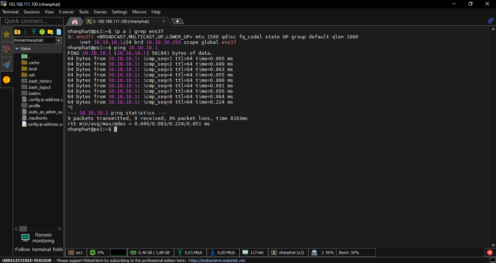

Mô hình Lab thực hiện trên các máy ảo VMware cài hệ điều hành Ubuntu.

Mục đích bài Lab:

Hiểu về mô hình triển khai DHCP.

Cấu hình DHCP cấp phát địa chỉ IP cho các client trong dải mạng VMnet0.

Cấu hình cấp phát IP theo địa chỉ MAC (cấu hình cho máy client 2).

Tắt DHCP cho các máy client sử dụng card Host-Only:

Thêm client :

Chọn card Host-Only:

2.2. Cài đặt DHCP Server
Bước 1: Cài đặt DHCP Server trên Ubuntu
Cập nhật danh sách gói và cài đặt gói isc-dhcp-server:

sudo apt update
sudo apt install isc-dhcp-server -y

Cách kiểm tra đã cài gói isc-dhcp-server:

Bước 2: Cấu hình giao diện cho DHCP Server
Mở file cấu hình DHCP Server:

sudo nano /etc/default/isc-dhcp-server

Tìm dòng:

INTERFACESv4=""

Sửa lại thành:

INTERFACESv4="ens37"

Bước 3: Cấu hình địa chỉ IP cho giao diện ens37 với Netplan
Mở file cấu hình Netplan (đường dẫn có thể là /etc/netplan/00-installer-config.yaml hoặc /etc/netplan/*.yaml):

sudo nano /etc/netplan/00-installer-config.yaml

Chỉnh sửa nội dung file như sau:

network:
  version: 2
  renderer: networkd
  ethernets:
    ens37:
      addresses:
        - 10.10.10.1/24
      dhcp4: no
      dhcp6: no

Lưu và áp dụng cấu hình:

sudo netplan apply

Kiểm tra lại địa chỉ IP của giao diện ens37:

ip a | grep ens37

4. Cấu hình DHCP Server

Mở file cấu hình DHCP:

sudo nano /etc/dhcp/dhcpd.conf

Thêm cấu hình sau:

subnet 10.10.10.0 netmask 255.255.255.0 {
  range 10.10.10.64 10.10.10.100;
  option routers 10.10.10.1;
  option domain-name-servers 8.8.8.8, 8.8.4.4;
  option broadcast-address 10.10.10.255;
  default-lease-time 600;
  max-lease-time 7200;
}

Bước 5: Khởi động và kiểm tra dịch vụ DHCP Server
Khởi động lại dịch vụ DHCP:

sudo systemctl restart isc-dhcp-server

Kiểm tra trạng thái dịch vụ:

sudo systemctl status isc-dhcp-server

Bước 6: Kiểm tra kết quả cấp phát IP cho các Client
Sau khi cấu hình xong và khởi động lại máy Client, kiểm tra giao diện mạng để xem IP đã được cấp phát hay chưa:

ip a | grep ens37

Kiểm tra kết nối từ Client đến DHCP Server:

ping 10.10.10.10

Bước 7: Đảm bảo DHCP Server tự động khởi động cùng hệ thống
Mở lại file cấu hình nếu cần (đảm bảo dòng INTERFACESv4="ens37" đã được thiết lập):

sudo nano /etc/default/isc-dhcp-server

ip a | grep ens37

Khởi động lại dịch vụ và kích hoạt chế độ tự động khởi động:

sudo systemctl restart isc-dhcp-server
sudo systemctl enable isc-dhcp-server

Bước 8: Kiểm tra nhật ký hoạt động của DHCP Server
Theo dõi nhật ký của dịch vụ để kiểm tra các thông báo hoạt động:

sudo journalctl -u isc-dhcp-server -f
